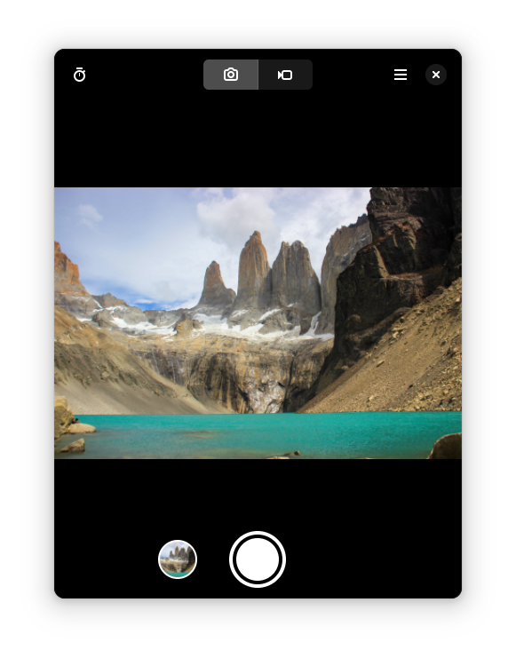

<!-- <a href="https://flathub.org/apps/details/org.gnome.World.Snapshot"> -->
<!--  -->
<!-- </a> -->

# Snapshot

Take pictures and videos

## Screenshots

<!-- ## Getting in touch -->

<!-- If you have any questions regarding the use or development of Snashot, please join us on our [#snapshot:gnome.org](https://matrix.to/#/#snapshot:gnome.org) channel. -->

## Hack on Emblem

To build the development version of Snapshot and hack on the code
see the [general guide](https://wiki.gnome.org/Newcomers/BuildProject)
for building GNOME apps with Flatpak and GNOME Builder.

<!-- ## Translations -->

<!-- Helping to translate Snapshot or add support to a new language is very welcome. -->
<!-- You can find everything you need at: [l10n.gnome.org/module/snapshot/](https://l10n.gnome.org/module/snapshot/) -->

## Code Of Conduct

This project follows the [GNOME Code of Conduct](https://wiki.gnome.org/Foundation/CodeOfConduct).
